# Banco de Dados — Schema e Decisões Técnicas

---

# 1. Visão Geral

## ORM e Banco
- **ORM:** Prisma 5.22 com `prisma-client-js`
- **Banco:** PostgreSQL 15+
- **Diagrama ERD:** `prisma/v1-erd.svg` (gerado automaticamente via `prisma-erd-generator`)
- **Schema:** `prisma/schema.prisma`

---

# 2. Diagrama ERD (Entidade-Relacionamento)

> Gerado via `prisma-erd-generator` a partir do `schema.prisma`.  
> Para regenerar após alterar o schema: `npm run db:generate` ou `npx prisma generate`.



---

# 2. Enums do Sistema

| Enum | Valores | Uso |
|---|---|---|
| `Role` | `ADMIN, SECRETARIA, PROFESSOR, COMUNICACAO` | Perfil de acesso dos funcionários |
| `MatriculaStatus` | `ATIVA, CONCLUIDA, EVADIDA, CANCELADA` | Status da matrícula de aluno em turma |
| `DiaSemana` | `SEG, TER, QUA, QUI, SEX, SAB, DOM` | Dias da grade horária |
| `TurmaStatus` | `PREVISTA, ANDAMENTO, CONCLUIDA, CANCELADA` | Ciclo de vida acadêmico da turma |
| `TipoDeficiencia` | `CEGUEIRA_TOTAL, BAIXA_VISAO, VISAO_MONOCULAR` | Classificação da deficiência visual |
| `CausaDeficiencia` | `CONGENITA, ADQUIRIDA` | Origem da deficiência |
| `PreferenciaAcessibilidade` | `BRAILLE, FONTE_AMPLIADA, ARQUIVO_DIGITAL, AUDIO` | Preferência do aluno |
| `CategoriaComunicado` | `NOTICIA, SERVICO, VAGA_EMPREGO, EVENTO_CULTURAL, LEGISLACAO, TRABALHO_PCD, GERAL` | Categoria dos comunicados |
| `CorRaca` | `BRANCA, PRETA, PARDA, AMARELA, INDIGENA, NAO_DECLARADO` | Autodeclaração étnico-racial |
| `StatusFrequencia` | `PRESENTE, FALTA, FALTA_JUSTIFICADA` | Status de presença na chamada |
| `AuditAcao` | `CRIAR, ATUALIZAR, EXCLUIR, ARQUIVAR, RESTAURAR, LOGIN, LOGOUT, MATRICULAR, DESMATRICULAR, FECHAR_DIARIO, REABRIR_DIARIO, MUDAR_STATUS` | Ações auditáveis |
| `TipoApoiador` | `VOLUNTARIO, EMPRESA, IMPRENSA, PROFISSIONAL_LIBERAL, ONG, OUTRO` | Classificação de apoiadores |
| `TipoCertificado` | `ACADEMICO, HONRARIA` | Tipo de certificado emitido |

---

# 3. Modelos (Tabelas)

## `User` — Funcionários do Sistema

| Campo | Tipo | Nullable | Descrição |
|---|---|---|---|
| `id` | UUID | — | PK |
| `matricula` | String | ✅ | Código de matrícula (ex: P20260001), único |
| `nome` | String | — | Nome completo |
| `username` | String | — | Login único (ex: joao.silva) |
| `email` | String | ✅ | E-mail único |
| `cpf` | String | ✅ | CPF único |
| `senha` | String | — | bcrypt hash |
| `precisaTrocarSenha` | Boolean | — | Flag de troca obrigatória no primeiro login |
| `role` | Role | — | Perfil de acesso (default: PROFESSOR) |
| `fotoPerfil` | String | ✅ | URL Cloudinary |
| `refreshToken` | String | ✅ | ⚠️ Legado |
| `refreshTokenExpiraEm` | DateTime | ✅ | ⚠️ Legado |
| `statusAtivo` | Boolean | — | Conta ativa (default: true) |
| `excluido` | Boolean | — | Soft delete permanente (default: false) |

**Índices:** `[statusAtivo, excluido]`, `[role]`, `[refreshTokenExpiraEm]`, `[cpf]`, `[email]`

**Relacionamentos:** `turmas[]` (como professor), `comunicados[]`, `sessoes[]` (UserSession)

---

## `UserSession` — Sessões de Autenticação

| Campo | Tipo | Nullable | Descrição |
|---|---|---|---|
| `id` | UUID | — | PK = sessionId embedded no refresh token |
| `userId` | UUID | — | FK User (cascade delete) |
| `refreshTokenHash` | String | — | bcrypt hash do secret atual |
| `previousRefreshTokenHash` | String | ✅ | Hash do secret anterior (anti-roubo) |
| `previousRotatedAt` | DateTime | ✅ | Timestamp da última rotação |
| `expiresAt` | DateTime | — | Expiração absoluta da sessão |
| `revokedAt` | DateTime | ✅ | Preenchido no logout (null = ativa) |
| `userAgent` | String | ✅ | Browser/app rastreado |
| `ip` | String | ✅ | IP do login |

**Índices:** `[userId]`, `[expiresAt]`, `[revokedAt]`

---

## `Aluno` — Beneficiários (alunos com deficiência visual)

Modelo mais rico do sistema. Agrupa dados em seções lógicas:

| Seção | Campos principais |
|---|---|
| Identificação | `matricula`, `nomeCompleto`, `dataNascimento`, `cpf`, `rg`, `genero`, `estadoCivil`, `corRaca` |
| Contato/Localização | `cep`, `rua`, `numero`, `complemento`, `bairro`, `cidade`, `uf`, `pontoReferencia`, `telefoneContato`, `email`, `contatoEmergencia` |
| Perfil da Deficiência | `tipoDeficiencia`, `causaDeficiencia`, `idadeOcorrencia`, `possuiLaudo`, `laudoUrl`, `tecAssistivas` |
| Documentos Legais | `termoLgpdAceito`, `termoLgpdAceitoEm`, `termoLgpdUrl`, `atestadoUrl`, `atestadoEmitidoEm` |
| Socioeconômico | `escolaridade`, `profissao`, `rendaFamiliar`, `beneficiosGov`, `composicaoFamiliar` |
| Saúde/Autonomia | `precisaAcompanhante`, `acompOftalmologico`, `outrasComorbidades` |
| Acessibilidade | `prefAcessibilidade` |
| Controle | `statusAtivo`, `excluido`, `criadoEm`, `atualizadoEm` |

**Índices:** `[statusAtivo, excluido]`, `[nomeCompleto]`, `[matricula]`, `[cpf]`, `[rg]`, `[email]`

---

## `Turma` — Oficinas do Instituto

| Campo | Tipo | Nullable | Descrição |
|---|---|---|---|
| `id` | UUID | — | PK |
| `nome` | String | — | Ex: "Oficina de Braille" |
| `descricao` | String | ✅ | Descrição da oficina |
| `capacidadeMaxima` | Int | ✅ | Limite de alunos (null = ilimitado) |
| `status` | TurmaStatus | — | Status acadêmico (default: PREVISTA) |
| `statusAtivo` | Boolean | — | Visibilidade (default: true) |
| `excluido` | Boolean | — | Soft delete |
| `dataInicio` | DateTime | ✅ | Início do período letivo |
| `dataFim` | DateTime | ✅ | Fim do período letivo |
| `cargaHoraria` | String | ✅ | Calculada automaticamente (ex: "40 horas") |
| `professorId` | UUID | — | FK User (professor responsável) |
| `modeloCertificadoId` | UUID | ✅ | FK ModeloCertificado |

**Índices:** `[statusAtivo, excluido]`, `[professorId]`

---

## `MatriculaOficina` — Vínculo Aluno-Turma

| Campo | Tipo | Descrição |
|---|---|---|
| `id` | UUID | PK |
| `status` | MatriculaStatus | ATIVA / CONCLUIDA / EVADIDA / CANCELADA |
| `dataEntrada` | DateTime | Data da matrícula |
| `dataEncerramento` | DateTime? | Preenchida ao sair da turma |
| `observacao` | String? | Motivo de cancelamento/evasão |
| `alunoId` | UUID | FK Aluno |
| `turmaId` | UUID | FK Turma |

> ⚠️ **Decisão técnica:** Sem `@@unique([alunoId, turmaId])`. A unicidade é validada no service: "aluno já tem matrícula ATIVA nessa turma?". Isso permite rematrículas após cancelamento/evasão sem erro de constraint.

**Índices:** `[alunoId]`, `[turmaId, status]`

---

## `GradeHoraria` — Horários Estruturados das Turmas

| Campo | Tipo | Descrição |
|---|---|---|
| `id` | UUID | PK |
| `dia` | DiaSemana | Dia da semana |
| `horaInicio` | Int | **Minutos desde meia-noite** (ex: 840 = 14:00) |
| `horaFim` | Int | Minutos desde meia-noite (ex: 960 = 16:00) |
| `turmaId` | UUID | FK Turma (cascade delete) |

> **Decisão técnica:** Horários em minutos inteiros evitam problemas de timezone e tornam cálculo de sobreposição trivial: `a.horaInicio < b.horaFim && b.horaInicio < a.horaFim`.

**Índices:** `[turmaId]`, `[turmaId, dia]`, `[dia, horaInicio, horaFim]`

---

## `Frequencia` — Chamada Diária

| Campo | Tipo | Descrição |
|---|---|---|
| `id` | UUID | PK |
| `dataAula` | DateTime `@db.Date` | **Apenas data**, sem hora (evita falsos negativos de timezone) |
| `presente` | Boolean | ⚠️ **Legado** — use `status` |
| `status` | StatusFrequencia | PRESENTE / FALTA / FALTA_JUSTIFICADA |
| `fechado` | Boolean | Diário encerrado (só ADMIN pode reabrir) |
| `fechadoEm` | DateTime? | Quando foi encerrado |
| `fechadoPor` | String? | userId de quem encerrou |
| `justificativaId` | UUID? | FK Atestado (falta justificada) |
| `alunoId` | UUID | FK Aluno |
| `turmaId` | UUID | FK Turma |

> ⚠️ **Tech Debt:** O campo `presente` é legado. Nunca atualizar sem sincronizar `status`. Remoção planejada em migration futura.

**Constraint unique:** `@@unique([dataAula, alunoId, turmaId])` — 1 registro por aluno por turma por dia.

---

## `Atestado` — Justificativas de Falta

| Campo | Tipo | Descrição |
|---|---|---|
| `dataInicio` | DateTime `@db.Date` | Primeiro dia coberto |
| `dataFim` | DateTime `@db.Date` | Último dia coberto |
| `motivo` | String | Ex: "Consulta médica" |
| `arquivoUrl` | String? | URL PDF/imagem no Cloudinary |
| `registradoPorId` | String | userId da secretaria que cadastrou |
| `alunoId` | UUID | FK Aluno |

---

## `AuditLog` — Trilha de Auditoria Imutável

| Campo | Tipo | Descrição |
|---|---|---|
| `id` | **cuid()** | ⚠️ Usa cuid() — diverge do padrão uuid() do projeto |
| `entidade` | String | Nome do modelo afetado |
| `registroId` | String? | ID do registro; null para LOGIN/LOGOUT |
| `acao` | AuditAcao | Ação realizada |
| `autorId` | String? | null = ação do sistema |
| `autorNome` | String? | Snapshot do nome |
| `autorRole` | String? | Snapshot do cargo |
| `ip` | String? | IP da requisição |
| `userAgent` | String? | Browser/client |
| `oldValue` | Json? | Estado anterior (ATUALIZAR/EXCLUIR) |
| `newValue` | Json? | Estado novo (CRIAR/ATUALIZAR) |

> **Regra crítica:** NUNCA deve ser alterado ou deletado. Apenas INSERT.
> **Tech Debt:** Usa `cuid()` em vez de `uuid()`. Mudar causaria drift destrutivo no banco.

---

## `SiteConfig` e `ConteudoSecao` — CMS do Site

`SiteConfig`: tabela chave-valor para configurações do site (cor primária, logo, nome do instituto).

| Campo | Tipo | Descrição |
|---|---|---|
| `chave` | String (PK) | Ex: "corPrimaria", "logo", "nomeInstituto" |
| `valor` | String | Valor da configuração |
| `tipo` | String | "texto" / "cor" / "url" / "numero" |

`ConteudoSecao`: conteúdo editável das seções da home pública.

| PK composta | Campos | Exemplos de chaves |
|---|---|---|
| `[secao, chave]` | `valor` (Text) | secao: "hero", chave: "titulo" |

---

## `ModeloCertificado` e `CertificadoEmitido`

`ModeloCertificado`: template de certificado com arte base, assinaturas e texto com tags `{{ALUNO}}`, `{{CH}}`, etc.

`CertificadoEmitido`: registro de emissão com `codigoValidacao` único para portal público de verificação.

---

# 4. Decisões de Design Críticas

### Por que dois campos `statusAtivo` e `excluido`?

| Campo | Significado | Reversível? |
|---|---|---|
| `statusAtivo: false` | Desativado temporariamente | ✅ Sim |
| `excluido: true` | Arquivamento permanente (LGPD) | ❌ Não (normalmente) |

Um funcionário pode ser desativado (férias, licença) e reativado. Já o arquivamento com `excluido: true` registra a intenção de exclusão lógica definitiva.

### Por que `@db.Date` na Frequencia?
O campo `dataAula` armazena apenas a data (sem hora). Sem isso, timestamps `2026-03-11T00:00:00.000Z` e `2026-03-11T03:00:00.000Z` seriam tratados como registros diferentes, causando duplicatas silenciosas.

### Por que `cuid()` no AuditLog?
O modelo foi criado antes da padronização `uuid()` do projeto. Mudar exigiria migração destrutiva do banco. Documentado como tech debt — padronização futura via script dedicado de migração de dados.

### Por que `MatriculaOficina` sem `@@unique`?
Permite que um aluno volte à mesma turma após cancelamento ou evasão. A regra de negócio ("não pode ter matrícula ATIVA duplicada") é validada no service, não como constraint de banco.

---

# 5. Migrations

```bash
# Criar nova migration (DEV)
npm run db:migrate:dev
# Ou com nome descritivo:
npx prisma migrate dev --name descricao_da_mudanca

# Aplicar migrations em produção
npm run db:migrate:deploy

# Verificar status das migrations
npx prisma migrate status
```

> **Regra:** Nunca editar arquivos de migration existentes em `prisma/migrations/`. Crie sempre uma nova migration para qualquer alteração.

---

# 6. Seed

```
prisma/seed/
├── index.ts              → Orquestra todos os seeders
├── admin-seeder.ts       → Cria/valida usuário admin
├── alunos-seeder.ts      → 500 alunos de exemplo (desenvolvimento)
└── site-config-seeder.ts → Configurações padrão do site
```

**Idempotência:** O seed pode ser reexecutado sem duplicar dados. O `adminSeeder` usa `upsert` com `update: {}` — nunca sobrescreve senha já alterada.

---

# 7. Pontos de Atenção

> [!WARNING]
> O campo `presente` (Boolean) em `Frequencia` é **legado**. Nunca atualize sem sincronizar `status`. Remoção planejada em migration futura após auditoria dos relatórios.

> [!WARNING]
> `AuditLog.id` usa `cuid()` enquanto todos os outros modelos usam `uuid()`. Não "corrigir" sem script de migração de dados — causaria reset destrutivo.

> [!IMPORTANT]
> Sempre use `DIRECT_URL` para migrations. O `DATABASE_URL` com PgBouncer não suporta o protocolo de prepared statements necessário para migrations.
