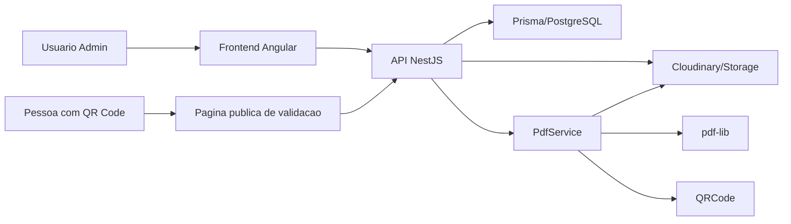

# Modulo: Certificados

## 1. Visao Geral

O modulo de certificados permite cadastrar templates visuais, posicionar textos, assinaturas e QR Code sobre uma imagem base, gerar PDFs com codigo unico de validacao e expor uma pagina publica de autenticidade.

No estado atual do sistema, a base ja existe com:

- `ModeloCertificado`: template visual, texto com variaveis, assinaturas e `layoutConfig`.
- `CertificadoEmitido`: registro da emissao, codigo de validacao e URL do PDF.
- `PdfService`: montagem do PDF com `pdf-lib`, QR Code com `qrcode` e fontes customizadas.
- Frontend Angular em `modelos-certificados`, com preview visual e drag and drop em coordenadas percentuais.
- Validacao publica em `/certificados/validar/:codigo` no backend e `/validar-certificado` no frontend.

## 2. Arquitetura Proposta



Separacao principal:

- Template: arte base, orientacao, tamanho e configuracoes do modelo.
- Layout: coordenadas e estilos dos elementos, sempre em percentual relativo ao canvas.
- Certificado emitido: snapshot operacional da emissao, codigo unico, PDF gerado, usuario emissor e status.
- Validacao publica: leitura segura por codigo, sem expor IDs internos.

## 3. Fluxo Completo

1. Admin cadastra um template e envia a imagem de fundo.
2. Admin define texto base com variaveis dinamicas.
3. Admin posiciona texto, nome do aluno, assinaturas e QR Code no editor visual.
4. Sistema salva o `layoutConfig` com coordenadas percentuais.
5. Usuario seleciona aluno, turma e modelo.
6. Backend valida obrigatorios, matricula, conclusao e frequencia minima quando aplicavel.
7. Backend gera ou reutiliza codigo unico de validacao.
8. Variaveis sao substituidas no texto final.
9. `PdfService` renderiza arte, textos, assinaturas e QR Code.
10. PDF e armazenado no storage e `CertificadoEmitido` registra a emissao.
11. QR Code aponta para a pagina publica de validacao.

## 4. Modos de Uso

Modo automatico:

- Usa posicoes padrao em `layoutConfig`.
- Ideal para emissao rapida por turma ou aluno.
- Campos esperados: nome do aluno, curso, carga horaria, datas, texto principal, assinaturas, QR Code e codigo.

Modo editor visual:

- Usa o componente Angular de preview com drag and drop.
- Elementos sao salvos em percentual: `x`, `y`, `width`, `size`, `maxWidth`.
- Estilos salvos por elemento: fonte, tamanho, cor e alinhamento.
- Layout pode ser reutilizado para novas emissoes.

## 5. Variaveis Dinamicas

O backend substitui variaveis com case-insensitive e aceita espacos internos, por exemplo `{{nome_aluno}}`, `{{ NOME_ALUNO }}` e `{{Nome_Aluno}}`.

Variaveis recomendadas:

| Variavel | Origem |
|---|---|
| `{{nome_aluno}}` | `Aluno.nomeCompleto` ou destinatario da honraria |
| `{{nome_curso}}` | `Turma.nome` |
| `{{curso}}` | Alias de `nome_curso` |
| `{{carga_horaria}}` | `Turma.cargaHoraria` |
| `{{ch}}` | Alias de `carga_horaria` |
| `{{data_inicio}}` | `Turma.dataInicio` |
| `{{data_fim}}` | `Turma.dataFim` |
| `{{data_emissao}}` | Data da emissao |
| `{{codigo_certificado}}` | Codigo unico publico |
| `{{codigo_validacao}}` | Alias de `codigo_certificado` |
| `{{nome_instituicao}}` | Nome institucional configuravel |
| `{{nome_responsavel}}` | Nome do assinante principal |
| `{{cargo_responsavel}}` | Cargo do assinante principal |
| `{{motivo}}` | Texto livre para honraria |

Para evoluir, criar um `CertificateVariableRegistry` com provedores por dominio: aluno, turma, instituicao, certificado e assinatura.

## 6. Modelo de Dados Atual

### ModeloCertificado

- `id`
- `nome`
- `arteBaseUrl`
- `assinaturaUrl`
- `assinaturaUrl2`
- `textoTemplate`
- `nomeAssinante`
- `cargoAssinante`
- `nomeAssinante2`
- `cargoAssinante2`
- `layoutConfig`
- `tipo`
- `criadoEm`
- `atualizadoEm`

### CertificadoEmitido

- `id`
- `codigoValidacao`
- `dataEmissao`
- `pdfUrl`
- `alunoId`
- `turmaId`
- `apoiadorId`
- `acaoId`
- `motivoPersonalizado`
- `modeloId`

## 7. Modelo de Dados Recomendado para Evolucao

Para cobrir todo o escopo com versionamento e cancelamento:

```prisma
enum CertificateStatus {
  VALIDO
  CANCELADO
  REEMITIDO
}

enum CertificateTemplateMode {
  AUTOMATICO
  EDITOR_VISUAL
  HIBRIDO
}

model CertificateLayout {
  id          String   @id @default(uuid())
  templateId  String
  name        String
  elementsJson Json
  isActive    Boolean  @default(true)
  createdAt   DateTime @default(now())
  updatedAt   DateTime @updatedAt
}

model CertificateVersion {
  id            String   @id @default(uuid())
  certificateId String
  version       Int
  pdfUrl        String
  snapshotJson  Json
  createdBy     String
  createdAt     DateTime @default(now())
}

model Signature {
  id                String   @id @default(uuid())
  responsibleName   String
  role              String
  signatureImageUrl String
  isActive          Boolean  @default(true)
  createdAt         DateTime @default(now())
  updatedAt         DateTime @updatedAt
}
```

Tambem adicionar em `CertificadoEmitido`:

- `status`
- `canceladoEm`
- `canceladoPor`
- `motivoCancelamento`
- `createdBy`
- `layoutSnapshot`
- `dadosSnapshot`
- `versaoAtual`

## 8. Estrutura do Layout

Contrato recomendado para `elementsJson`:

```json
[
  {
    "id": "nome-aluno",
    "type": "text",
    "binding": "nome_aluno",
    "text": "{{nome_aluno}}",
    "x": 10,
    "y": 42,
    "width": 80,
    "height": 8,
    "fontFamily": "Great Vibes",
    "fontSize": 60,
    "color": "#000000",
    "textAlign": "center",
    "zIndex": 20,
    "visible": true
  },
  {
    "id": "qr",
    "type": "qrCode",
    "x": 82,
    "y": 80,
    "width": 10,
    "height": 10,
    "zIndex": 30,
    "visible": true
  }
]
```

Tipos previstos:

- `text`
- `dynamicText`
- `signatureImage`
- `signatureBlock`
- `qrCode`
- `validationCode`
- `line`
- `image`

## 9. Endpoints

Templates:

- `POST /api/modelos-certificados`
- `GET /api/modelos-certificados`
- `GET /api/modelos-certificados/:id`
- `PATCH /api/modelos-certificados/:id`
- `DELETE /api/modelos-certificados/:id`
- `POST /api/modelos-certificados/:id/upload-arte`

Layouts, quando separados do template:

- `POST /api/certificate-layouts`
- `GET /api/certificate-layouts/template/:templateId`
- `PATCH /api/certificate-layouts/:id`
- `POST /api/certificate-layouts/:id/duplicar`
- `DELETE /api/certificate-layouts/:id`

Certificados:

- `POST /api/modelos-certificados/emitir-academico`
- `POST /api/modelos-certificados/emitir-honraria`
- `POST /api/certificados/emitir-lote`
- `GET /api/certificados`
- `GET /api/certificados/:id`
- `GET /api/certificados/:id/download`
- `PATCH /api/certificados/:id/cancelar`
- `POST /api/certificados/:id/reemitir`
- `GET /api/certificados/validar/:codigo`

Assinaturas:

- `POST /api/assinaturas`
- `POST /api/assinaturas/:id/upload`
- `GET /api/assinaturas`
- `PATCH /api/assinaturas/:id`
- `PATCH /api/assinaturas/:id/desativar`

## 10. Frontend

Telas atuais:

- Lista de modelos.
- Formulario wizard de modelo.
- Preview visual com drag and drop.
- Validacao publica.

Telas recomendadas para completar o escopo:

- Biblioteca de templates com status ativo/inativo.
- Editor visual dedicado com area central, toolbar e painel de propriedades.
- Geracao individual com selecao de template, layout, aluno, curso e assinaturas.
- Geracao em lote via CSV/XLSX com pre-validacao de linhas.
- Historico de certificados emitidos, cancelados e reemitidos.

## 11. Estrategia de PDF

Biblioteca atual: `pdf-lib`.

Motivos:

- Gera PDF no backend sem browser headless.
- Permite embutir imagem, texto, fontes, assinatura e QR Code.
- Boa previsibilidade para impressao.

Cuidados:

- Coordenadas do frontend sao percentuais; backend converte para pontos/pixels do PDF.
- Usar snapshot de layout e dados no momento da emissao.
- Validar URLs de imagem para evitar SSRF.
- Usar fontes locais/cacheadas quando possivel.
- Para lote grande, processar em fila assincrona.

## 12. Estrategia de QR Code

QR Code deve apontar para:

```text
{FRONTEND_URL}/validar-certificado?codigo={{codigo_certificado}}
```

A pagina publica deve exibir:

- Nome do aluno/destinatario.
- Curso/certificacao.
- Carga horaria.
- Data de emissao.
- Status.
- Codigo de validacao.
- Indicio claro de valido ou invalido.

Certificados cancelados devem retornar status invalido quando o campo `status` for incorporado ao banco.

## 13. Geracao em Lote

Fluxo recomendado:

1. Usuario importa CSV/XLSX.
2. Backend valida colunas obrigatorias.
3. Sistema cria um job de lote.
4. Cada linha gera um certificado isolado.
5. Erros por linha nao abortam todo o lote.
6. Ao final, usuario baixa um ZIP ou consulta os PDFs gerados.

Bibliotecas:

- Backend: `exceljs` para XLSX.
- Frontend: `xlsx` para pre-visualizacao local.
- Fila futura: BullMQ + Redis.

## 14. Regras de Negocio

- Codigo de validacao deve ser unico e publico.
- Certificado emitido nao deve ser alterado diretamente.
- Correcao deve gerar nova versao ou historico.
- QR Code sempre aponta para o codigo valido.
- Layouts podem ser duplicados.
- Templates podem ser reutilizados.
- Cancelamento torna a validacao publica invalida.
- Upload aceita apenas MIME e extensoes seguras.
- Toda emissao registra usuario, data e hora.
- PDF deve preservar posicionamento entre preview e geracao.

## 15. Bibliotecas Recomendadas

Ja usadas:

- `pdf-lib`
- `qrcode`
- `@pdf-lib/fontkit`
- `jimp`
- `exceljs`
- Angular CDK DragDrop

Possiveis evolucoes:

- `zod` ou DTOs dedicados para validar `layoutConfig`.
- BullMQ para lote.
- `sharp`, se o ambiente de deploy suportar binarios nativos.
- Storage S3 compativel caso seja necessario controle mais forte sobre PDFs.

## 16. Pontos de Atencao

- O layout antigo em objeto fixo deve conviver com `elementsJson` generico durante a migracao.
- PDFs emitidos precisam de snapshot para evitar que mudancas no template alterem historico.
- Cancelamento exige status persistido no banco.
- Codigo curto de 8 hexadecimais e pratico, mas pode ser ampliado para reduzir chance de colisao em escala.
- Upload e renderizacao devem manter allowlist de hosts e limite de tamanho.
- O editor visual precisa de acessibilidade: controles numericos para posicao alem de mouse/drag.

## 17. Criterios de Aceitacao

- Cadastrar template com imagem.
- Posicionar texto, assinaturas e QR Code.
- Usar variaveis no texto base.
- Substituir variaveis corretamente.
- Gerar PDF.
- Exibir QR Code de validacao.
- Validar publicamente pelo codigo.
- Baixar PDF.
- Salvar e reutilizar layout.
- Manter posicionamento do preview no PDF final.
